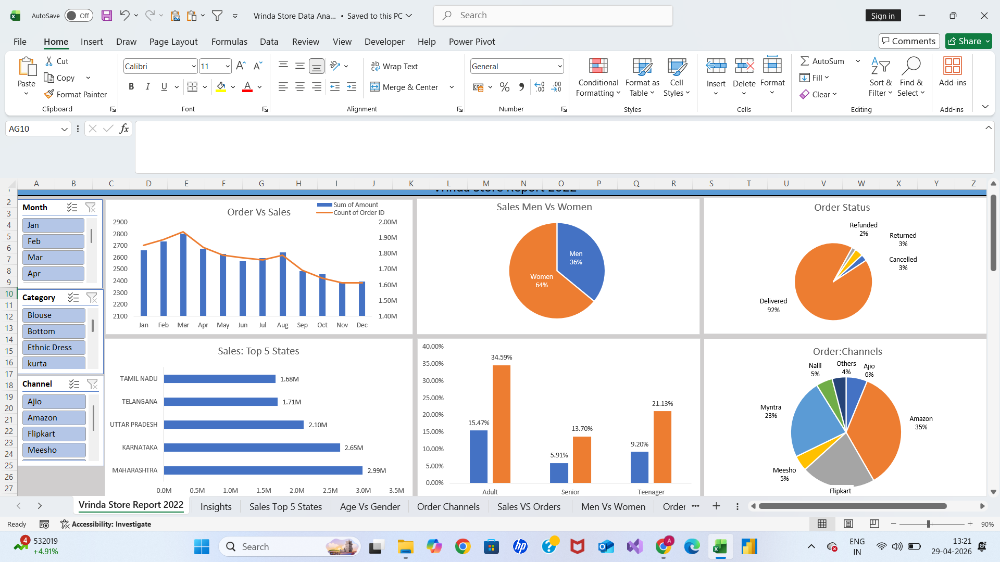

# 📊 Vrinda Store Data Analysis

## 🔍 Project Objective
Analyze sales data to identify trends, top-performing states, and customer behavior.

## 🛠 Tools Used
- Microsoft Excel
- Pivot Tables
- Charts & Dashboard

## 📈 Key Insights
- Women contribute higher sales compared to men
- Maharashtra generates highest revenue
- Amazon is the top sales channel

## 📷 Dashboard Preview

## 🎯 Conclusion
This project demonstrates my ability to clean, analyze, and visualize data using Excel.
